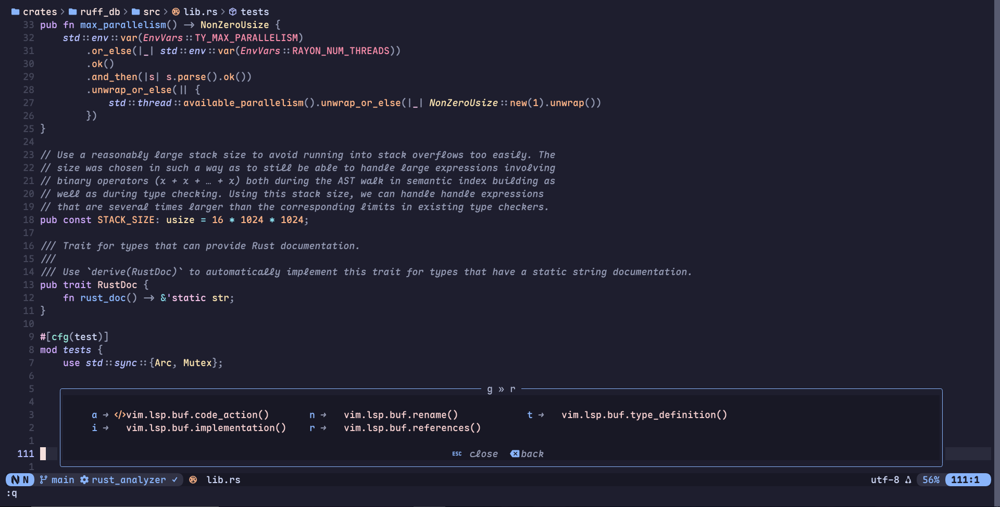
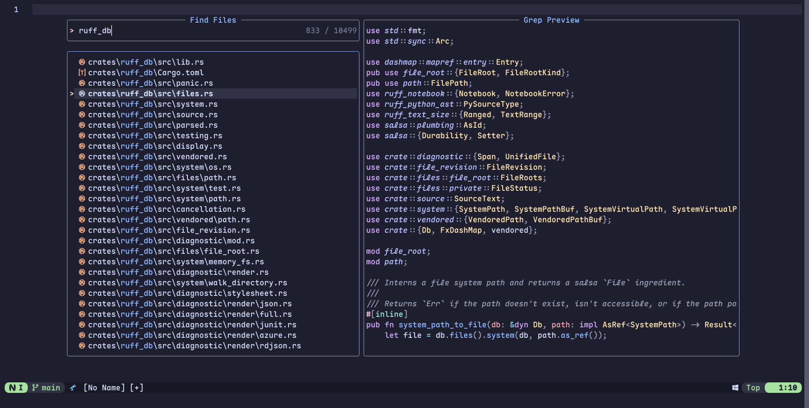

<div align="center">
<h1>Neovim configuration</h1>
My personal Neovim config configuartion.
<div/>

<div align="center">
    
    
</div>

_^ Rust code with Maple Mono font ^_

## Highlights

- Plugin management with [`Lazy.nvim`](https://github.com/folke/lazy.nvim), configured to be very lazy
- Awesome [Catppuccin](https://catppuccin.com) Mocha theme
- [Neovide](https://neovide.dev) config included
- Abbreviations for some common misspellings in command names (like `:W` or `:Qa!`)
- TS and LSP support for Rust, Go, Lua, Gleam, C, Python and more
- Formatting with [`conform.nvim`](https://github.com/stevearc/conform.nvim)
- Seearching in files and buffers with [`Telescope`](https://github.com/nvim-telescope/telescope.nvim)
- Autocomplete with [`blink.cmp`](https://github.com/saghen/blink.cmp)
- Snippets with [`luasnip`](https://github.com/L3MON4D3/LuaSnip) and [`friendly-snippets`](https://github.com/rafamadriz/friendly-snippets)
- Easy to remember keymap with [`which-key`](https://github.com/folke/which-key.nvim)
- IDE-like breadcrumbs with [`dropbar.nvim`](https://github.com/Bekaboo/dropbar.nvim)

## Requirements

- Neovim >= 0.11
- Git
- A Nerd Font (optional)
- A C compiler for nvim-treesitter
- Language servers, used here (optional):
  - rust_analyzer
  - asm_lsp
  - gleam
  - gopls
  - ts_ls
  - astro
  - clangd
  - basedpyright
  - ty
  - lua_ls
  - zls
- ripgrep (optional)
- fzf (optional)
- fd (optional)

## Setup

0. Remove or backup your existing config:

```shell
mv ~/.config/nvim ~/.config/nvim.bak
mv ~/.local/share/nvim ~/.local/share/nvim.bak
```

1. Clone this repo to your Neovim config directory:

```shell
# cd to your nvim config directory
cd ~/.config/nvim
# then clone repo to it
git clone https://github.com/ankddev/nvim-config.git .
```

2. Remove `.git`, so you can make your own repo later.

## License

Licensed under Apache License 2.0, see [LICENSE](./LICENSE)
